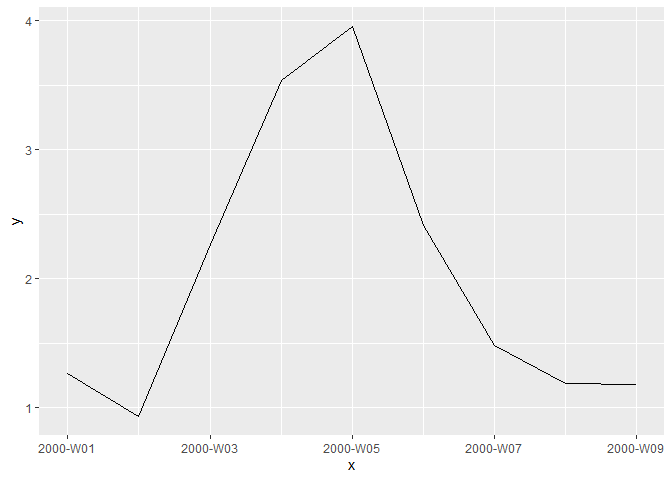

<!-- README.md is generated from README.Rmd. Please edit that file -->

# A Class for Week Numbers

[](https://travis-ci.org/hmalmedal/weeknumber)

A class for week numbers, according to ISO 8601.

## Installation

Install from [GitHub](https://github.com/hmalmedal/weeknumber):

``` r
remotes::install_github("hmalmedal/weeknumber")
```

## Examples

Coercion to the week number class:

``` r
library(weeknumber)
as_weeknumber(c(-1:1, 51:52, NA))
#> <weeknumber[6]>
#> [1] 1999-W52 2000-W01 2000-W02 2000-W52 2001-W01 <NA>
as_weeknumber("2000-W01")
#> <weeknumber[1]>
#> [1] 2000-W01
as_weeknumber(as.Date("2000-12-28"))
#> <weeknumber[1]>
#> [1] 2000-W52
```

Make week number object from year and week:

``` r
make_weeknumber(2000:2001, 4:6)
#> <weeknumber[3]>
#> [1] 2000-W04 2001-W05 2000-W06
make_weeknumber(2019:2020, 53)
#> <weeknumber[2]>
#> [1] <NA>     2020-W53
```

Get year and week number from an object:

``` r
x <- as_weeknumber(c(-1:1, 51:52, NA))
year_week(x)
#> $year
#> [1] 1999 2000 2000 2000 2001   NA
#> 
#> $week
#> [1] 52  1  2 52  1 NA
```

Print a tibble:

``` r
set.seed(0)
library(tibble)
d <- tibble(
  x = seq(as_weeknumber("2000-W01"), as_weeknumber("2000-W09")),
  y = cumsum(rnorm(length(x)))
)
print(d)
#> # A tibble: 9 x 2
#>          x     y
#>     <week> <dbl>
#> 1 2000-W01 1.26 
#> 2 2000-W02 0.937
#> 3 2000-W03 2.27 
#> 4 2000-W04 3.54 
#> 5 2000-W05 3.95 
#> 6 2000-W06 2.41 
#> 7 2000-W07 1.49 
#> 8 2000-W08 1.19 
#> 9 2000-W09 1.18
```

Plot with week number scale:

``` r
library(ggplot2)
p <- ggplot(d, aes(x, y)) +
  geom_line()
print(p)
```


